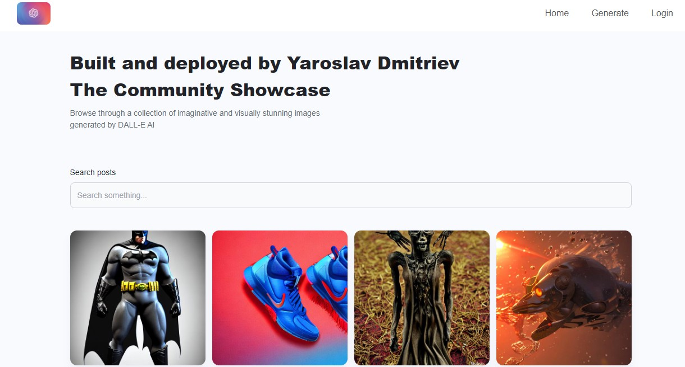

# DALL-E 2.0 🎨




DALL-E 2.0 is a powerful application that allows users to search for images, download them, share them with the community, and even generate their own images using Artificial Intelligence. This application utilizes state-of-the-art technologies to provide a seamless experience for users. 

👉 **[Try out the live demo!](https://dall-e-2-0-two.vercel.app/)** 👈

📌 **New Feature:** Generate custom images powered by advanced AI technology!

## Installation

To install this project on your local machine, follow these steps:
```
git clone https://github.com/ElonMusk2002/DALL-E-2.0.git
```

```
cd DALL-E
```

```
npm install
```

```
npm start
```


## Usage 

Search for any image, download and share images, or use the AI image generator to create custom images! 

Some examples:

- Search for "kitten playing with ball of yarn"
- Generate an image of "an astronaut riding a horse on Mars" 
- Download and share an image of "a flower bouquet"

## Dependencies

| Name | Version | 
|-|-|
| React | ^18.2.0 |
| React-DOM | ^18.2.0 |  
| Firebase | ^9.18.0 |
| Material-UI | ^5.11.15 |
| React Router DOM | ^6.9.0 |
| UUID | ^9.0.0 |
| Web Vitals | ^2.1.4 |
| Emotion React | ^11.10.6 |
| Emotion Styled | ^11.10.6 |
| Testing Library | ^5.16.5 |

## Contribute 

Contributions are welcome! ♥️

**To get started:**

1. 🍴 Fork this repo
2. 🔨 Add your changes  
3. 📤 Create a PR

We're excited to see what you build!
